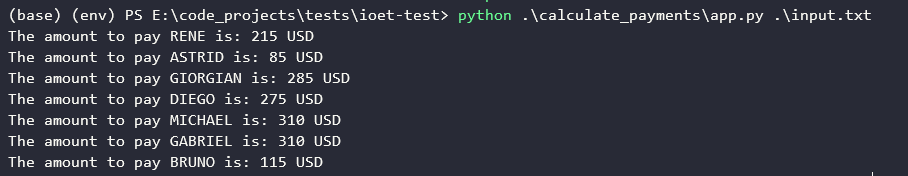

# ioet Test
## How to run

This project was developed using **Python** 3.7.3, **Pip** 22.0.4, **Virtualenv** 20.14.1 and **PyTest** 7.1.2. To install this PyTest version on your environment, you must run:
>$ pip install pytest==7.1.2

After that, you must install run the following command to install the project package in editable mode:
>$ pip install -e .

If you wish to run all the tests, use this command:
>$ pytest -v

To run the program, use this command:
>$ python calculate_payments/app.py {path_of_the_input_file.txt}

## Overview
The following input was used as test to run the project:
> RENE=MO10:00-12:00,TU10:00-12:00,TH01:00-03:00,SA14:00-18:00,SU20:00-21:00
> ASTRID=MO10:00-12:00,TH12:00-14:00,SU20:00-21:00
> GIORGIAN=MO07:00-11:00,WE14:00-19:00,FR07:00-14:00
> DIEGO=FR14:30-19:00,SA11:00-13:00,SU04:00-10:00
> MICHAEL=TU06:00-23:59
> GABRIEL=MO08:00-19:00,FR22:00-00:00,SA05:00-08:00
> BRUNO=MO09:00-10:00,WE18:00-23:00

After run the program, the output was, as expected, this: 

## Methodology

This project was developed using the TDD (Test-Driven Development) concept. The work was done from the most basic part of the project, which would be the reading of the file containing the necessary input data, going through all the necessary data processing and calculations, until its end, with the writing of the expected output in the terminal. After that, a short refactoring process was carried out in some methods, as well as in their respective tests. The intention was that the project had a simple architecture that could handle all project requirements but also be able to add new features, if necessary. The code writing followed the requirements of PEP8 and some of the concepts of Clean Coding as well. 

## Solution diagram

